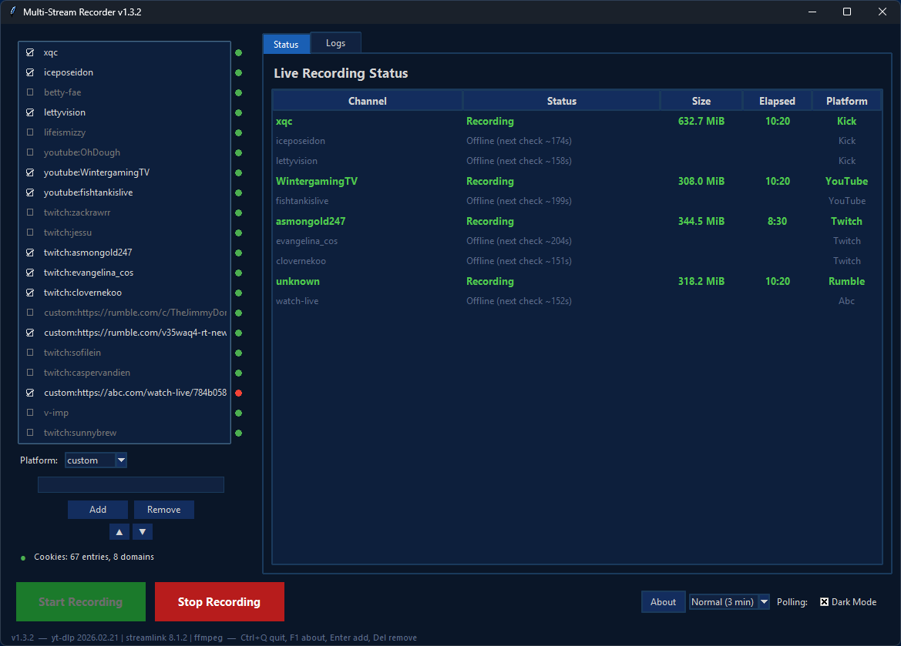

# Multi-Stream Recorder

A desktop application for simultaneously recording live streams from **Kick**, **Twitch**, **YouTube**, **Rumble**, and any site supported by yt-dlp. Set it up, press record, and walk away — it monitors channels, auto-records when they go live, and produces clean MP4 files.



## Features

* **Multi-platform** — Record from Kick, Twitch, YouTube Live, Rumble, and 1,800+ sites via custom URLs
* **Concurrent recording** — Monitor and record multiple streams simultaneously
* **Automatic detection** — Polls channels and starts recording the moment a stream goes live
* **Smart polling** — Configurable check intervals with jitter to avoid rate limiting; exponential backoff on errors only
* **Fast reconnect** — If a stream drops briefly (streamer disconnect), re-detects within 15 seconds
* **Clean MP4 output** — Automatically remuxes raw .ts recordings to .mp4 with ffmpeg
* **Cloudflare bypass** — Kick streams use streamlink's built-in JS challenge solver; Rumble uses browser impersonation fallback
* **Dark mode GUI** — Full dark/light theme with system tray support and desktop notifications
* **Cookie support** — Use browser cookies for authenticated access (subscriber-only streams, age-gated content)
* **Cookie health indicator** — Visual status showing if your cookies are valid, expiring, or need renewal
* **Per-channel control** — Start or stop individual channels mid-session via right-click context menu
* **Channel reorder** — Rearrange your channel list with ▲/▼ buttons
* **Recording metadata** — JSON sidecar files with channel info, stream title, duration, and timestamps
* **Auto-cleanup** — Configurable retention period for processed files
* **Robust shutdown** — No orphaned processes, no zombie ffmpeg instances

## Quick Start

### 1. Install Prerequisites

**Python 3.10+** is required. Then install the external tools:

**ffmpeg** (required):

```
# Windows — download from https://www.gyan.dev/ffmpeg/builds/
# Add the bin/ folder to your system PATH

# Linux
sudo apt install ffmpeg

# macOS
brew install ffmpeg
```

**yt-dlp** (required for YouTube, Rumble, custom URLs):

```
pip install yt-dlp
```

**streamlink** (required for Twitch and Kick):

```
pip install streamlink
```

### 2. Install Python Dependencies

```
pip install -r requirements.txt
```

Or install individually:

```
pip install yt-dlp                # Required for YouTube, Rumble, custom URLs
pip install streamlink            # Required for Twitch and Kick
pip install psutil                # Recommended — cleaner process management
pip install pystray Pillow plyer  # Optional — tray icon & notifications
pip install curl_cffi             # Optional — Rumble Cloudflare bypass
```

### 3. Run

```
python Multi-Stream-Recorder.py
```

On first launch, the program creates a `config.ini` with sensible defaults. Edit `streams_dir` to set where recordings are saved.

### 4. Add Channels

Use the GUI to add channels:

1. Select a platform from the dropdown (kick, twitch, youtube, custom)
2. Enter the channel name (e.g., `asmongold` for Kick, `saruei` for Twitch)
3. For custom URLs, paste the full URL:
   - Rumble channels: `https://rumble.com/c/ChannelName`
   - Chaturbate: `https://chaturbate.com/username/`
   - Any yt-dlp supported site: paste the stream URL
4. Click **Add** or press **Enter**

Press **Start Recording** — the program will monitor all channels and record any that go live.

## Cookies Setup

Cookies are optional but recommended for YouTube (avoids throttling) and required for subscriber-only content on any platform.

### Exporting Cookies

1. Install the [Get cookies.txt LOCALLY](https://chromewebstore.google.com/detail/get-cookiestxt-locally/cclelndahbckbenkjhflpdbgdldlbecc) browser extension (Chrome/Edge)
2. Visit the streaming site and log in
3. Click the extension icon → **Export** → save as `cookies.txt`
4. Place the file in your streams directory (e.g., `E:\Streams\cookies.txt`)

The program auto-detects `cookies.txt` in your streams directory or the script's folder. The cookie indicator in the GUI shows whether your cookies are valid and warns when auth tokens are expiring.

## Configuration

All settings are in `config.ini`, auto-created on first run:

```
[Paths]
streams_dir = E:\Streams          # Where recordings are saved
channels_file = channels.json     # Channel list (managed by GUI)
cookies_file =                    # Auto-detected if empty

[Recording]
quality = best                    # Stream quality
max_record_hours = 12.0           # Auto-stop after N hours
min_disk_space_gb = 5.0           # Pause if disk space falls below
min_file_size_mb = 2.0            # Delete recordings smaller than this
filename_pattern = {username}_{timestamp}  # Output filename pattern

[Timeouts]
poll_interval_minutes = 3         # How often to check offline channels
poll_jitter_percent = 20          # Random ±% added to each check
error_backoff_max_minutes = 15    # Max delay on server errors
reconnect_grace_minutes = 3       # Fast polling after a stream drops

[Cleanup]
auto_purge_days = 7               # Delete old temp files (0 = disabled)
purge_on_startup = true           # Clean up when program starts

[Advanced]
verbose = false                   # Extra logging
ffmpeg_path = ffmpeg              # Path to ffmpeg binary

[GUI]
dark_mode = true                  # Start in dark mode
minimize_to_tray = true           # Minimize to system tray
notifications = true              # Desktop notifications
```

### Filename Patterns

The `filename_pattern` setting supports these tokens:

| Token | Example | Description |
| --- | --- | --- |
| `{username}` | `asmongold` | Channel name |
| `{platform}` | `twitch` | Platform name |
| `{timestamp}` | `20260211_213445` | Date and time |
| `{date}` | `20260211` | Date only |
| `{time}` | `213445` | Time only |
| `{title}` | `Playing_Elden_Ring` | Stream title (sanitized) |

Default: `{username}_{timestamp}` → `asmongold_20260211_213445.mp4`

## Directory Structure

```
E:\Streams\
├── Recorded\              # Raw recordings organized by platform
│   ├── kick\
│   │   └── asmongold\
│   │       ├── asmongold_20260211_213445.ts
│   │       └── asmongold_20260211_213445.meta.json
│   ├── twitch\
│   │   └── saruei\
│   ├── youtube\
│   │   └── OhDough\
│   └── custom\
│       └── rumble\
├── Processed\             # Remuxed MP4 files
│   ├── kick\
│   ├── twitch\
│   ├── youtube\
│   └── custom\
├── PendingDeletion\       # Temp files awaiting cleanup
├── channels.json          # Channel list
├── config.ini             # Configuration
└── cookies.txt            # Browser cookies (optional)
```

## Keyboard Shortcuts

| Key | Action |
| --- | --- |
| `Enter` | Add channel from text field |
| `Delete` | Remove selected channel |
| `Ctrl+Q` | Quit application |
| `F1` | About dialog |
| Right-click on channel | Context menu (Start/Stop Recording, Open in Browser, Copy, Remove) |
| Right-click on status | Context menu (Restart/Stop Channel, Open in Browser) |

## How It Works

1. **Monitoring**: Each channel gets its own worker process. Workers check if the stream is live at the configured polling interval with random jitter.
2. **Detection**: Kick streams are checked via streamlink (with Cloudflare JS challenge solver). Twitch streams are checked via streamlink. YouTube and custom URLs use yt-dlp's `--dump-json`. Rumble channel pages are resolved to their current live video URL.
3. **Recording**: Live streams are recorded as MPEG-TS files. Kick and Twitch use streamlink. YouTube, Rumble, and custom URLs use yt-dlp with ffmpeg as the HLS downloader.
4. **Reconnection**: If a recording drops unexpectedly (process exits after >10 seconds of recording), the worker enters a 3-minute fast-poll mode (every 15 seconds) to catch stream reconnects.
5. **Processing**: When you click Stop (or the stream ends), raw .ts files are remuxed to .mp4 with ffmpeg (including `+faststart` for seekability), metadata sidecars are saved, and the originals are moved to PendingDeletion.

## Polling Behavior

The polling system is designed to be responsive without being abusive to servers:

| State | Check Interval | Behavior |
| --- | --- | --- |
| **Offline** | Every 3 min ± jitter | Flat interval, no backoff. Catches streams within minutes of going live. |
| **Error** | Doubles each time, max 15 min | Exponential backoff on server errors. Resets immediately on success. |
| **Reconnect** | Every 15 seconds for 3 min | Fast polling after a stream drops unexpectedly. |
| **Recording** | Continuous | No polling needed — the recording process handles the stream. |

The GUI includes a **Polling** dropdown to switch between Relaxed (5 min), Normal (3 min), and Fast (1 min) presets.

## Troubleshooting

**"ffmpeg not found"** — Install ffmpeg and ensure it's in your system PATH. Test with `ffmpeg -version` in a terminal.

**YouTube 403/503 errors** — Your cookies have likely expired. Re-export them from your browser. The cookie indicator in the GUI will warn you when this happens.

**Kick 403 errors** — Make sure you don't have an old third-party Kick plugin overriding streamlink's built-in one. Check `%APPDATA%\streamlink\plugins\` for a `kick.py` file and delete it if present. Streamlink 8.x includes a built-in Kick plugin with Cloudflare bypass.

**Kick streams not recording** — Kick requires streamlink 8.0+. Update streamlink: `pip install -U streamlink`. The program uses streamlink (not yt-dlp) for Kick detection and recording.

**Rumble streams not detected** — Add Rumble channels as custom URLs using the channel page format: `https://rumble.com/c/ChannelName`. If you get 403 errors, install `curl_cffi` for browser impersonation: `pip install curl_cffi`.

**Twitch recordings have no audio** — This is rare but can happen with certain streamlink versions. Update streamlink: `pip install -U streamlink`

**Large recordings produce corrupt MP4** — The remux timeout scales automatically with file size (1 minute per GB + buffer). If you still have the `.ts` file in PendingDeletion, you can re-remux manually: `ffmpeg -i recording.ts -c copy -movflags +faststart output.mp4`

**Large .ts files in Recorded folder** — These are raw recordings that haven't been remuxed yet. This happens if you force-quit the program instead of using Stop. Restart the program and it will clean them up.

**Program won't close** — If the window is unresponsive, use Ctrl+Q. The program uses a multi-layered shutdown: graceful stop → process tree kill → orphan cleanup → os.\_exit as a final backstop.

## Platform Notes

**Kick**: Uses streamlink for both detection and recording. Streamlink 8.x includes a built-in Cloudflare JS challenge solver that handles Kick's aggressive bot detection. Cookies are optional. Streams are recorded in 1080p by default. **Important**: Remove any old third-party `kick.py` plugins from `%APPDATA%\streamlink\plugins\` — they override the built-in plugin and break Cloudflare bypass.

**Twitch**: Uses streamlink with `--twitch-disable-ads` and `--twitch-low-latency`. Cookies are optional but enable subscriber-only features.

**YouTube**: Uses yt-dlp. Cookies are recommended to avoid throttling. YouTube Live DVR streams work but may produce "keepalive request failed" messages in verbose mode — these are harmless and don't affect the recording.

**Rumble**: Uses yt-dlp. Add channels as custom URLs using the channel page format (`https://rumble.com/c/ChannelName`). The program automatically resolves channel pages to the current live video URL. If Cloudflare blocks access, the program falls back to browser impersonation via `curl_cffi` (install with `pip install curl_cffi`). When a Rumble channel is offline, the program correctly detects this without downloading previous VODs.

**Custom URLs**: Uses yt-dlp, which supports [1,800+ sites](https://github.com/yt-dlp/yt-dlp/blob/master/supportedsites.md). Direct `.m3u8` HLS links also work. Select "custom" from the platform dropdown and paste the full URL.

## Requirements

| Dependency | Required | Purpose |
| --- | --- | --- |
| Python 3.10+ | Yes | Runtime |
| ffmpeg | Yes | Remux .ts → .mp4 |
| yt-dlp | Yes | YouTube, Rumble, custom URL recording |
| streamlink | Yes | Kick and Twitch stream recording |
| psutil | Recommended | Clean process management |
| curl_cffi | Recommended | Rumble Cloudflare bypass |
| pystray + Pillow | Optional | System tray icon |
| plyer | Optional | Desktop notifications |

## Author

Created by ManletPride, built with assistance from Claude (Anthropic) and and Grok (xAI).

## License

MIT License. See [LICENSE](LICENSE) for details.
