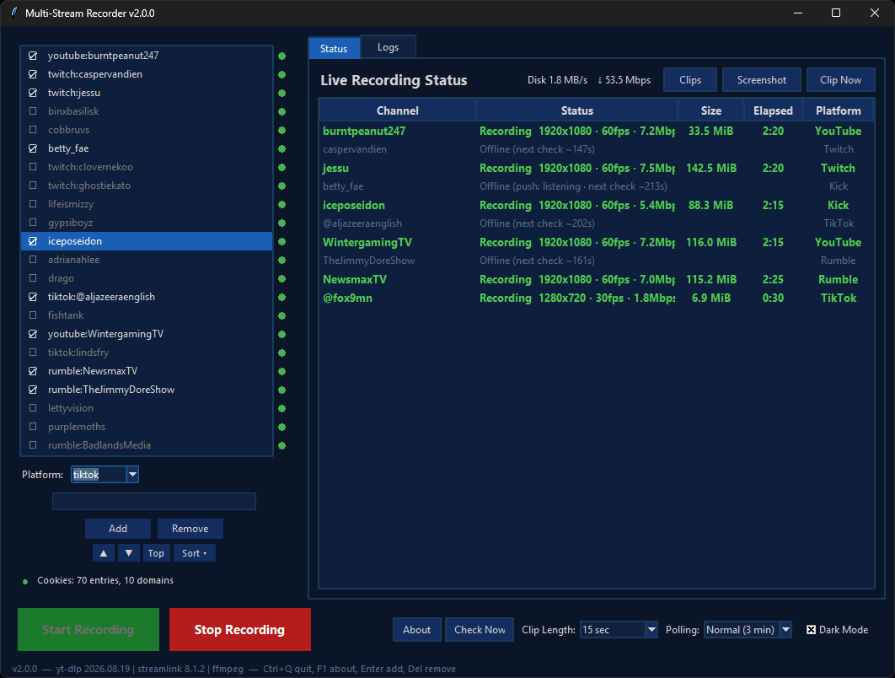

# Multi-Stream Recorder

A desktop application for simultaneously recording live streams from **Kick**, **Twitch**, **YouTube**, **Rumble**, **TikTok**, **Fishtank.live**, and any site supported by yt-dlp. Set it up, press record, and walk away — it monitors channels, auto-records when they go live, and produces clean MP4 files.

This is **v2.0.0**. Upgrading from the v1.8.0 single-file app: copy `Multi-Stream-Recorder.py` **and** the `msr\` folder, then fully quit and relaunch. Details: [RELEASE_NOTES_v2.0.0.md](RELEASE_NOTES_v2.0.0.md).



## Features

* **Multi-platform** — Record from Kick, Twitch, YouTube Live, Rumble, TikTok, Fishtank.live, and 1,800+ sites via custom URLs
* **Split-track HLS** — Automatically detects and records CMAF streams with separate video/audio playlists (used by Chaturbate and other CDN-backed platforms)
* **Concurrent recording** — Monitor and record multiple streams simultaneously
* **Automatic detection** — Polls channels and starts recording the moment a stream goes live
* **Kick push notifications** — Kick recordings start within seconds of going live via Kick's own WebSocket event feed, with polling as fallback (see *Kick Push Notifications*)
* **Smart polling** — Configurable check intervals with jitter to avoid rate limiting; exponential backoff on errors only
* **Instant clips & screenshots** — While a channel is recording, use **Clip Now** or **Screenshot** on the Status tab (or right-click the row) to stream-copy the last N seconds of its live .ts into a standalone MP4, or grab a still — neither interrupts the ongoing recording. Clips start on a video keyframe so audio and video begin together. Toolbar presets are 15 sec–5 min; Custom goes from 5 sec to 30 min
* **Custom poll rate** — Pick a preset (1/3/5 min) or set any custom interval from 30 seconds to 2 hours; changes apply instantly to running sessions
* **Check Now** — Skip the poll timer entirely: one button checks every enabled channel immediately, or right-click a single channel to check just that one
* **Fast reconnect** — If a stream drops briefly (streamer disconnect), re-detects within 15 seconds
* **File splitting** — Automatically splits recordings at a configurable size limit (default 8 GB), and on mid-stream resolution changes that would otherwise corrupt playback
* **Clean MP4 output** — Automatically remuxes raw .ts recordings to .mp4 with ffmpeg, and warns if a finished recording has no audio track
* **Cloudflare bypass** — Kick streams use streamlink's built-in JS challenge solver; Rumble records the HLS playlist from the channel page (ffmpeg) so yt-dlp does not have to open Cloudflare-gated video pages
* **Dark mode GUI** — Full dark/light theme with system tray support and desktop notifications
* **Live stream info** — Status table shows resolution, frame rate, and bitrate for all active recordings
* **Disk & network meters** — Status header shows whole-disk write rate and NIC download rate (`psutil`). Hover for this app’s recording totals; the text colors if the recordings disk is write-busy
* **Cookie support** — Use browser cookies for authenticated access (subscriber-only streams, age-gated content), with an indicator showing whether yours are valid or expiring
* **Per-channel control** — Start or stop individual channels mid-session via right-click; removing a channel from the roster also stops its worker
* **Roster jump** — **Top** (next to the up/down arrows) or right-click **Move to Top** / **Move to Bottom** to jump selected channels without stepping one row at a time
* **Recording metadata** — JSON sidecar files with channel info, stream title, duration, and timestamps
* **Micro-fragment throttle** — Detects CDN reset storms (repeated sub-30s recordings) and backs off rather than accumulating dozens of tiny files
* **Auto-cleanup** — Configurable retention period for processed files
* **Robust shutdown** — No orphaned processes, no zombie ffmpeg instances

## Quick Start

1. **Python 3.10+** from [python.org](https://www.python.org/downloads/). On Windows, check **Add python.exe to PATH**. Debian/Ubuntu also needs Tk for the GUI: `sudo apt install python3-tk`.

2. **ffmpeg and ffprobe** on your PATH. Close and reopen the terminal, then check:

```
ffmpeg -version
ffprobe -version
```

Windows (easiest): `winget install Gyan.FFmpeg`  
Or download a build from https://www.gyan.dev/ffmpeg/builds/ and add its `bin` folder to PATH.  
Linux: `sudo apt install ffmpeg`  
macOS: `brew install ffmpeg`

3. Put `Multi-Stream-Recorder.py` and the `msr\` folder in the **same directory**. The `.py` file is only the launcher.

4. In that directory:

```
pip install -r requirements.txt
python Multi-Stream-Recorder.py
```

First launch writes `config.ini`. Recordings go to `%USERPROFILE%\Videos\Multi-Stream Recorder` (Windows) or `~/Videos/Multi-Stream Recorder`. Set `streams_dir` in `config.ini` to use another folder.

5. In the GUI: pick a platform, enter the channel name (Kick `asmongold`, Twitch `saruei`, …) or a full URL for **custom**, click **Add** (or Enter), then **Start Recording**.

**If you need it later**

- YouTube recordings that drop every ~15 seconds → install [Deno](https://deno.com/) and confirm `deno --version`
- Subscriber-only or age-gated streams → [Cookies Setup](#cookies-setup)
- No window: `python Multi-Stream-Recorder.py --headless` (enabled rows in `channels.json`; Ctrl+C to stop)
- `python Multi-Stream-Recorder.py --version` or `--config my.ini` as needed

## Cookies Setup

Cookies are optional but recommended for YouTube (avoids throttling) and required for subscriber-only content on any platform.

### Exporting Cookies

1. Install the [Get cookies.txt LOCALLY](https://chromewebstore.google.com/detail/get-cookiestxt-locally/cclelndahbckbenkjhflpdbgdldlbecc) browser extension (Chrome/Edge)
2. Visit the streaming site and log in
3. Click the extension icon → **Export** → save as `cookies.txt`
4. Place the file in your streams directory (`streams_dir` in `config.ini` — by default `Videos\Multi-Stream Recorder`)

The program auto-detects `cookies.txt` in that folder or next to `Multi-Stream-Recorder.py`. The cookie indicator in the GUI shows whether your cookies are valid and warns when auth tokens are expiring. MSR **does not** log in or refresh that file — when tokens expire, re-export from a logged-in browser. Keep one combined `cookies.txt` for all sites; a Rumble-only export must not replace the whole jar.

## Configuration

All settings are in `config.ini`, auto-created on first run:

```
[Paths]
streams_dir =                     # Blank on first run is filled with
                                   # %USERPROFILE%\Videos\Multi-Stream Recorder
                                   # (Windows) or ~/Videos/Multi-Stream Recorder.
                                   # Existing configs keep whatever you set (e.g. E:\Streams).
channels_file = channels.json     # Channel list (managed by GUI)
cookies_file =                    # Auto-detected if empty

[Recording]
quality = best                    # Stream quality
max_record_hours = 12.0           # Auto-stop after N hours (0 = no limit)
max_file_size_gb = 8.0            # Split recording when file exceeds this size (0 = disabled)
split_on_resolution_change = true # Split when the live video's resolution changes mid-stream
                                   # (e.g. TikTok multi-guest battles), instead of muxing two
                                   # resolutions into one file, which corrupts playback
min_disk_space_gb = 5.0           # Pause if disk space falls below
min_file_size_mb = 2.0            # Delete recordings smaller than this
filename_pattern = {username}_{timestamp}  # Output filename pattern

[Timeouts]
poll_interval_minutes = 3         # How often to check offline channels (fractional values OK, e.g. 0.7)
poll_jitter_percent = 20          # Random ±% added to each check
error_backoff_max_minutes = 15    # Max delay on server errors
reconnect_grace_minutes = 3       # Fast polling after a stream drops

[Cleanup]
auto_purge_days = 7               # Delete old temp files (0 = disabled)
purge_on_startup = true           # Clean up when program starts
max_log_size_mb = 20              # Rotate stream_recorder.log at startup past this size (0 = never)
log_backup_count = 3              # How many rotated logs to keep (.1 … .N)

[Clipping]
clip_length_seconds = 30          # Default length for "Clip Now" — also settable live from
                                   # the toolbar's Clip Length selector (15 sec to 30 min)
clips_dir =                       # Where clips/screenshots are saved (blank = streams_dir\Clips)
screenshot_format = jpg           # jpg (default), png, or webp
screenshot_quality = 2            # jpg: 2–31 (lower is better) | webp: 50–100 (higher is better)
                                   # png: ignored — always lossless

[Advanced]
verbose = false                   # Extra logging — see "Logging" below before turning this on
ffmpeg_path = ffmpeg              # Path to ffmpeg binary
youtube_player_client =           # yt-dlp player_client override (blank = yt-dlp's default,
                                   # which is what you want; see YouTube troubleshooting)

[GUI]
dark_mode = true                  # Start in dark mode
minimize_to_tray = true           # Minimize to system tray
notifications = true              # Desktop notifications
```

The generated `config.ini` also has less-commonly changed keys (`stream_check_timeout`, `ffmpeg_timeout`, `concurrent_fragments`, `streamlink_debug`, and others) with comments in the file.

### Filename Patterns

The `filename_pattern` setting supports these tokens:

| Token | Example | Description |
| --- | --- | --- |
| `{username}` | `asmongold` | Channel name |
| `{platform}` | `twitch` | Platform name |
| `{timestamp}` | `20260211_213445` | Date and time |
| `{date}` | `20260211` | Date only |
| `{time}` | `213445` | Time only |
| `{title}` | `Playing_Elden_Ring` | Stream title (sanitized) |

Default: `{username}_{timestamp}` → `asmongold_20260211_213445.mp4`

## Directory Structure

```
Videos/Multi-Stream Recorder/   # default streams_dir (or the path you set)
├── Recorded\              # Raw recordings organized by platform
│   ├── kick\
│   │   └── asmongold\
│   │       ├── asmongold_20260211_213445.ts
│   │       └── asmongold_20260211_213445.meta.json
│   ├── twitch\
│   │   └── saruei\
│   ├── youtube\
│   │   └── OhDough\
│   ├── custom\
│   │   └── chaturbate\
│   │       ├── kittycaitlin\
│   │       └── kaydenwithpaul\
│   └── fishtank\
│       └── director\
├── Processed\             # Remuxed MP4 files
│   ├── kick\
│   ├── twitch\
│   ├── youtube\
│   ├── custom\
│   └── fishtank\
├── Clips\                 # Clips and screenshots grabbed from live recordings
│   ├── kick\
│   └── twitch\
├── PendingDeletion\       # Temp files awaiting cleanup
├── channels.json          # Channel list
├── config.ini             # Configuration
├── kick_channel_ids.json  # Cached Kick channel IDs (auto-created; used by push notifications)
└── cookies.txt            # Browser cookies (optional)
```

## Keyboard Shortcuts

| Key | Action |
| --- | --- |
| `Enter` | Add channel from text field |
| `Delete` | Remove selected channel |
| `Ctrl+Q` | Quit application |
| `F1` | About dialog |
| Double-click on channel | Toggle channel on/off |
| Right-click on channel | Context menu (Start/Stop Recording, Check Now, Open in Browser, Open Clips Folder, Copy, Sort, Move to Top/Bottom, Remove) |
| Right-click on status | Context menu (Restart/Stop Channel, Check Now, Clip Now, Screenshot Now, Open in Browser, Open Clips Folder) |
| **Clip Now** / **Screenshot** / **Clips** buttons | Cut a clip, grab a still, or open the clips folder for the row selected in Live Recording Status (same as the context-menu actions) |

## How It Works

1. **Monitoring**: Each channel gets its own worker process. Workers check if the stream is live at the configured polling interval with random jitter.
2. **Push notifications (Kick)**: A WebSocket to Kick's event feed wakes the matching worker on go-live. Polling continues as fallback. See *Kick Push Notifications* below.
3. **Detection**: Kick streams are checked via streamlink (with Cloudflare JS challenge solver). Twitch streams are checked via streamlink. YouTube and custom URLs use yt-dlp's `--dump-json`. Rumble channel pages are parsed for a live entry (and its HLS playlist) from the JSON the site embeds in the page.
4. **Recording**: Live streams are recorded as MPEG-TS files. Kick and Twitch use streamlink. YouTube and standard custom URLs use yt-dlp with ffmpeg as the HLS downloader. Rumble records that channel-page HLS playlist with ffmpeg when present; otherwise yt-dlp with `--impersonate chrome`. Custom URLs whose streams have separate video and audio playlists (CMAF/split-track HLS, e.g. Chaturbate) are recorded using a direct ffmpeg command that follows both playlists concurrently and muxes them in real time.
5. **Stream info**: Once the output file reaches ~1.5 MB, a background ffprobe thread reads it and updates the status display with measured resolution, frame rate, and bitrate.
6. **Reconnection**: If a recording drops unexpectedly (process exits after >10 seconds of recording), the worker enters a 3-minute fast-poll mode (every 15 seconds) to catch stream reconnects.
7. **Processing**: When you click Stop (or the stream ends), raw .ts files are remuxed to .mp4 with ffmpeg (including `+faststart` for seekability), metadata sidecars are saved, and the originals are moved to PendingDeletion.

## Instant Clips & Screenshots

With a channel selected in **Live Recording Status** (it must be Recording):

- **Clip Now** (button on the Status header, or right-click the row) — stream-copies the last N seconds (set by the **Clip Length** toolbar selector) out of that channel's live .ts file into its own MP4, saved under `Clips\{platform}\{channel}\` (custom Chaturbate-style URLs: `Clips\custom\<site>\<user>\`).
- **Screenshot** (button on the Status header, or right-click **Screenshot Now**) — grabs a single frame from near the current end of the same .ts file as a still image.
- **Clips** (Status header button, or right-click **Open Clips Folder** on a status row or the left roster) — opens that channel's folder under `Clips\`.

Screenshots default to **JPEG at near-lossless quality** (~200–400 KB for a 1080p frame). Set `screenshot_format` in `config.ini` to `png` for lossless output (~2 MB per 1080p frame) or `webp` for the smallest files. Note that the quality scales run in opposite directions between formats — jpg is 2–31 where lower is better, webp is 50–100 where higher is better — so change `screenshot_quality` to match whenever you switch formats; out-of-range values are clamped to a sane default with a warning in the log.

Both read the .ts file the worker is still writing, so the main recording is never paused. Clips use `-c copy` (no re-encoding).

The cut starts on the last video **keyframe** at or before the requested time, using elapsed time in the file — not the MPEG-TS PCR clock, which can sit at ~10000s while the recording is only minutes long. A clip may therefore begin up to a GOP earlier than requested (~2s on Kick) rather than opening frozen with audio playing. Repeat Clip Now clicks on the same channel are ignored until the in-flight cut finishes.

## Project layout

```
Multi-Stream-Recorder.py   # launcher (run this)
msr/
  gui.py                   # Tkinter UI
  worker.py                # per-channel recording process, clips, remux
  platforms.py             # Kick / Twitch / YouTube / Rumble / TikTok / Fishtank / custom
  recorder.py              # session orchestrator, cleanup, Kick push
  iometer.py               # Status-header disk write / NIC download rates
  util.py / config.py / deps.py
tests/                     # unittest (python -m unittest discover -s tests -t .)
```

## Logging

MSR writes to `stream_recorder.log` in your streams directory, and mirrors the same output to the console and the GUI's **Logs** tab. Stream URLs and ffmpeg/yt-dlp command lines are redacted before logging so Kick/Fishtank JWTs and Cookie/Authorization headers do not land in the file.

`verbose` in `config.ini` is **off by default, and should usually stay off.** Turning it on does two things: it passes `--verbose` to yt-dlp/streamlink, and it disables the stderr noise filter that normally discards per-segment chatter. Turn it on to diagnose a specific failure, then turn it back off.

A handful of patterns are dropped even in verbose mode, because they flood the log without ever being useful. The worst offender is ffmpeg's HLS demuxer announcing every playlist tag it doesn't parse (`Skip ('#EXT-X-DATERANGE…`, `#EXT-X-CUEPOINT`) — YouTube re-advertises its full set of ad markers on every playlist refresh, so in one 24/7 YouTube session those lines alone were **84% of the entire log**. "Skipped a tag I don't handle" is ffmpeg working correctly, so it's suppressed unconditionally; genuine errors and warnings are never filtered in either mode.

The log is rotated at startup once it passes `max_log_size_mb`, keeping `log_backup_count` older copies (`stream_recorder.log.1` … `.3`). Rotation happens at launch rather than continuously because recording workers are separate processes writing to the same file, and renaming a file they hold open fails on Windows. A single very long session can therefore exceed the limit; it gets trimmed the next time you start MSR.

The GUI's Logs tab trims itself to the most recent few thousand lines, and the queue feeding it drops oldest pending lines past 2000, so leaving MSR running for days (or turning verbose on) won't grow its memory use.

## Polling Behavior

The polling system is designed to be responsive without being abusive to servers:

| State | Check Interval | Behavior |
| --- | --- | --- |
| **Offline** | Every 3 min ± jitter | Flat interval, no backoff. Catches streams within minutes of going live. |
| **Offline (Kick, push active)** | Instant + polling | Kick's event feed wakes the worker within seconds of go-live; the poll timer keeps running as a fallback. |
| **Error** | Doubles each time, max 15 min | Exponential backoff on server errors. Resets immediately on success. |
| **Reconnect** | Every 15 seconds for 3 min | Fast polling after a stream drops unexpectedly. |
| **Recording** | Continuous | No polling needed — the recording process handles the stream. |

The GUI includes a **Polling** dropdown to switch between Relaxed (5 min), Normal (3 min), and Fast (1 min) presets — or select **Custom…** to enter any interval from 0.5 to 120 minutes. A floor of 30 seconds is enforced; checking more often than that risks rate limiting or IP bans, which is exactly what the jitter system exists to prevent. Interval changes apply to running sessions immediately — workers don't need a restart, and they don't finish out their old sleep first.

The **Check Now** button skips the poll timer entirely and immediately checks every enabled channel (with a small stagger between them, so a long channel list doesn't hit its platforms all at once). To check a single channel, right-click it in the channel list or status table and select **Check Now** — available whenever the channel is offline or in error backoff. Use this when a stream just went live and you don't want to wait out the current polling cycle.

### Kick Push Notifications

Polling has an unavoidable blind spot: a stream that goes live right after a check isn't caught until the next one, so the first minute or three of a broadcast can be missed. For Kick channels, MSR closes this gap with push notifications.

At session start, MSR opens a single WebSocket to Kick's real-time event feed (the Pusher service that powers the kick.com website's own live notifications) and subscribes to every enabled Kick channel. When Kick pushes its go-live event, the matching worker is woken immediately — recordings typically begin within seconds of the broadcast starting. In the status table, Kick channels covered by push show it in the detail column:

```
Offline    push: listening · next check ~57s
```

Design notes:

- **Push supplements polling; it never replaces it.** The poll timer keeps running underneath. If the WebSocket disconnects, is blocked, or the required packages aren't installed, Kick channels behave exactly as they did before this feature existed — the `push: listening` tag disappearing from the detail column is the indicator that you're on polling only.
- **The push event is a hint, not a truth.** A go-live event triggers the normal streamlink liveness check before any recording starts, so spurious or duplicate events are harmless.
- **One connection, all channels.** Adding, removing, starting, or stopping Kick channels mid-session updates the subscriptions live.
- Channel IDs are resolved once per channel and cached in `kick_channel_ids.json`, so the Cloudflare-protected lookup happens only on the first session per channel.

Requires two optional packages: `pip install websocket-client curl_cffi`. Without them, Kick channels fall back to polling with a note in the log.

## Troubleshooting

**"ffmpeg not found"** — Install ffmpeg and make sure it's in your system PATH. Test with `ffmpeg -version`.

**YouTube 403/503 errors** — Usually expired cookies (re-export them; the GUI indicator warns you). Otherwise update yt-dlp: `pip install -U "yt-dlp[default]"`. Keep the `[default]` extra — it pulls in `yt-dlp-ejs` for YouTube's JS challenge.

**YouTube: detected as live, but recording dies immediately with "No video formats found!"** — YouTube requires a GVS PO Token for certain player clients, and binds it to the video ID. If a client is pinned that needs one, yt-dlp finds no downloadable formats even though the stream is plainly live — the give-away is that detection keeps working while every recording ends in seconds (often tripping the micro-fragment throttle). Leave `youtube_player_client` blank in `config.ini`: yt-dlp's defaults deliberately favour clients that don't need a PO Token. Only set it to work around a specific regression, and install [Deno](https://deno.com/) so the JS challenge can be solved properly.

**TikTok stream not detected** — Check that `cookies.txt` has current TikTok cookies; `msToken` and `ttwid` expire periodically and need re-exporting from a logged-in session. If yt-dlp says `"The channel is not currently live"` while the browser shows LIVE (common on 24/7 news LIVEs), MSR cross-checks `/api-live/user/room`, the `/live` page, and both Webcast hosts. Look for `TikTok live API confirms LIVE` or `TikTok webcast check:` in the log. US-TTP rooms that yt-dlp misses still go through the same fallback.

**TikTok: "No video formats found"** — The channel was added as a `custom:` URL pointing at the bare profile instead of the live endpoint. Re-add it using the `tiktok` platform dropdown.

**Kick 403 errors / streams not recording** — Kick needs streamlink 8.0+ (`pip install -U streamlink`), which has the built-in Cloudflare challenge solver. Also check `%APPDATA%\streamlink\plugins\` for an old third-party `kick.py` and delete it — it overrides the built-in plugin and breaks the bypass.

**Kick push: no "push: listening" in the status column** — Push needs two optional packages: `pip install websocket-client curl_cffi`. The session-start log says which is missing. Recording still works normally via polling either way.

**Kick push: was working, stopped working** — If the socket connects but no `Kick push: listening for <channel>` lines follow, Kick has rotated their Pusher application key. Open any kick.com page with DevTools → Network → **WS**, copy the new `wss://ws-usX.pusher.com/app/...` URL, and update `KICK_PUSHER_URL` in `msr/recorder.py`.

**Rumble streams not detected / HTTP 403** — Detection reads the channel page (`Rumble HTML check:`). Recording prefers the HLS playlist embedded in that page so yt-dlp does not have to open the Cloudflare-gated video page. If you still see 403, install `curl_cffi` (`pip install curl_cffi`) and keep yt-dlp current: `pip install -U "yt-dlp[default]"`. A logged-in Rumble session in `cookies.txt` can help but is not required for public streams. Stale `cf_clearance` cookies sometimes make 403 *worse* — delete the rumble.com rows and re-export if impersonation still fails. Note that Rumble periodically restructures its channel pages; if detection breaks after a site change, `parse_rumble_channel_html` in `msr/platforms.py` is the single place that reads their page format.

**Twitch recordings have no audio** — Rare, and usually a streamlink version issue: `pip install -U streamlink`.

**Fishtank recordings have no audio** — Fishtank's CDN sometimes serves video-only segments on certain cameras (notably Cameraman). Server-side; the recorder can't fix it, but logs `⚠ NO AUDIO TRACK` after remux so affected files are easy to find.

**Fishtank: many short recordings in a row** — Their CDN resetting connections every 20–30 seconds during busy periods. MSR detects this after 5 consecutive short recordings and backs off. Normal behavior.

**Large .ts files left in Recorded** — Raw recordings that were never remuxed, usually from force-quitting instead of using Stop. Restart and they're cleaned up automatically. To remux one by hand: `ffmpeg -i recording.ts -c copy -movflags +faststart output.mp4`

**Screenshot fails with a decode error** — The very end of a live .ts is an incomplete frame, so grabs are taken ~3 seconds behind the live edge, retrying further back if needed. A failure here usually means the recording only just started; wait a few seconds and try again.

**Clip opens frozen for ~2 seconds with audio playing** — That was a stream-copy seek landing mid-GOP (audio at t=0, video at the next keyframe). Current builds seek to the preceding keyframe in *elapsed* file time. If you still see a full-GOP freeze, fully quit and relaunch MSR so it loads the current `msr/worker.py` — the GUI does not reload modules while running.

**Clip is only a couple of seconds long, or seeks from the wrong place** — Twitch/Kick MPEG-TS can report `format.duration` as the last PCR (~10000s+) instead of elapsed file time, or N/A on a still-healthy live capture. Current builds convert PCR to elapsed seconds and fall back to seeking from the end of the file (`-sseof`) when duration is missing. Fully quit and relaunch if an old worker is still loaded.

**Program won't close** — Use Ctrl+Q if the window is unresponsive. Shutdown is layered: graceful stop → process tree kill → orphan cleanup → `os._exit` as a final backstop.


## Fishtank.live

[Fishtank.live](https://www.fishtank.live/) is a reality TV live streaming site with multiple camera feeds broadcasting simultaneously. MSR records those cameras with automatic authentication and live detection.

**Room names and stream IDs change every season**, and again in the off-season. Do not treat the alias table below as the live house map. The **API and HLS URL shape stay the same**; when a new season starts, add cameras by their raw stream id from the catalog (see *Finding stream IDs*). Scraping the website HTML does not work — it is a client-rendered shell with no camera list.

### Setup

Add a `[Fishtank]` section to your `config.ini` with your fishtank.live account credentials:

```ini
[Fishtank]
email = your@email.com
password = yourpassword
```

A free account is sufficient. The program handles authentication automatically — it logs in, obtains a stream token, and refreshes it as needed. No manual cookie export is required.

### Adding cameras

Select **fishtank** from the platform dropdown and enter either a friendly alias (if we still have one) or the **raw stream id**:

```
fishtank:director
fishtank:kitchen
fishtank:dirc-5
fishtank:bar-5
```

New-season and off-season cameras that are not in the alias table are still valid if you paste the catalog id (`something-6`, `ben-5`, `computer-lab2-5`, …).

### Finding stream IDs

The site loads cameras from `GET https://api.fishtank.live/v1/live-streams` (needs to be logged in in the browser). Each entry in `liveStreams` has:

| Field | Meaning |
| --- | --- |
| `id` | Stream id to paste into MSR (`dirc-5`, `bar-5`, …) |
| `name` | Display name this season (Director Mode, Bar, Bedroom 3, …) |
| `access` | `public`, `normal`, or `season_pass` |
| `season` | Season number in the id suffix |

Off-season, `liveStreamStatus` and `loadBalancer` are often empty (nothing is live) while `liveStreams` still lists every id. That list is what to copy from — not the page source.

### Stable endpoints

These are what MSR actually talks to; they should survive a season change:

- Login: `POST https://api.fishtank.live/v1/auth/log-in`
- Catalog / liveness: `GET https://api.fishtank.live/v1/live-streams`
- HLS: `https://<streams-*.fishtank.live>/hls/live+<id>/index.m3u8?jwt=<token>`

The stream host (`streams-c`, `streams-f`, …) is discovered from the API, not hardcoded.

### Season 5 aliases (snapshot)

Friendly names MSR still recognises from the Season 5 house. Several of these **already do not match the off-season catalog** (Bar is `bar-5` not `brrr-5`; Arena/Goo Factory/Jungle/Computer Lab were renamed to bedrooms; contestant cams `ben-5` / `jet-5` appeared). Old aliases are kept so existing rosters keep resolving. Prefer a raw id once Season 6 ships.

| Camera name | Room (Season 5) | Access (Season 5) |
|---|---|---|
| `director` | Director Mode | Free |
| `dorm` | Dorm | Normal |
| `dormalt`, `dorm2`, `dmrm2` | Dorm Alternate | Normal |
| `closet` | Closet | Normal |
| `kitchen` | Kitchen | Normal |
| `bar` | Bar (`bar-5`; S5 house was `brrr-5`) | Normal |
| `barptz` | Bar PTZ | Season Pass |
| `baralt`, `bar2`, `brrr2` | Bar Alternate | Normal |
| `hallway` | Hallway | Normal |
| `dining` | Dining Room | Normal |
| `market` | Market | Normal |
| `marketalt`, `market2` | Market Alternate | Normal |
| `foyer` | Foyer | Normal |
| `glassroom` | Glassroom | Normal |
| `corridor` | Corridor | Normal |
| `eastwing` | East Wing | Normal |
| `westwing` | West Wing | Normal |
| `laundry`, `laundryroom` | Laundry Room | Season Pass |
| `jungle` | Jungle Room | Season Pass |
| `computerlab`, `bbcl` | Computer Lab | Season Pass |
| `jobboard`, `job`, `jobb` | Job Board | Normal |
| `confessional` | Confessional | Season Pass |
| `cameraman` | Cameraman | Season Pass XL |
| `arena` | Arena | Normal |
| `goofactory`, `goofact`, `goo`, `br3g` | Goo Factory | Normal |

Short aliases also work — `cam` for Cameraman, `dirc` for Director, `dmrm` for Dorm. Season 5 renames (`balcony` → `eastwing`, `hallwayup` → `westwing`, `jacuzzi` → `laundry`) still resolve.

`channels_fishtank.json` is the same Season 5 snapshot. Rename it to `channels.json` only if you want that house roster; it will not track Season 6 by itself.

### How It Works

Detection and recording both use fishtank.live's HLS streams served by MistServer. On each poll the program queries the live-streams API to see which ids are `online`, then records via ffmpeg's HLS downloader. The JWT comes from the login API and is refreshed automatically — a background thread renews it with a 5-minute buffer, which matters for cameras that get short-lived 30-minute tokens (Cameraman in Season 5).

Before each recording starts, MSR fetches the HLS master playlist and selects the highest-bandwidth variant, rather than whichever rendition the server lists first.

After each remux, MSR checks that the MP4 has an audio track. Fishtank's CDN occasionally delivers video-only HLS segments; a warning is logged so those files are easy to find.

## Platform Notes

**Kick**: Uses streamlink for both detection and recording (`quality = best` in `config.ini`, which is streamlink's best available rendition). Streamlink 8.x includes a built-in Cloudflare JS challenge solver that handles Kick's aggressive bot detection. Cookies are optional. With `websocket-client` and `curl_cffi` installed, Kick channels also get push notifications (see *Kick Push Notifications* above). **Important**: Remove any old third-party `kick.py` plugins from `%APPDATA%\streamlink\plugins\` — they override the built-in plugin and break Cloudflare bypass.

**Twitch**: Uses streamlink with `--twitch-disable-ads` and `--twitch-low-latency`. Cookies are optional but enable subscriber-only features.

**TikTok**: Uses yt-dlp for detection and streamlink for recording. Add channels by selecting **tiktok** from the platform dropdown and entering the username (with or without `@`). Valid TikTok session cookies are required — export them from a logged-in browser session using the Get cookies.txt extension and place the file in your streams directory. The `msToken` and `ttwid` cookies are the critical ones; when they expire, re-export.

TikTok's CDN delivers mobile-portrait video (typically 540×960 or 720×1280) at 25 fps. This is normal — it reflects what the streamer's phone is broadcasting.

**US-TTP regional detection**: A majority of US-based TikTok streamers (especially gaming streamers) run on TikTok's US regional infrastructure (`webcast.us.tiktok.com`). yt-dlp's TikTok extractor currently hardcodes the global endpoint (`webcast.tiktok.com`), which returns "offline" for these accounts even when they are actively live. MSR includes a fallback that directly queries both regional Webcast API endpoints whenever yt-dlp reports a TikTok channel as offline. If the fallback confirms the stream is live, recording proceeds normally — no user action required. The log will note `"Webcast API confirms LIVE"` when this override fires.

**YouTube**: Uses yt-dlp. Cookies are recommended to avoid throttling. Install [Deno](https://deno.com/) so yt-dlp can solve YouTube's JS n-challenge — without it, recordings tend to drop out every ~15 seconds. Player client selection is left to yt-dlp by default, which is deliberate: YouTube requires PO Tokens for some clients, so pinning one in `youtube_player_client` is a good way to break recording (see Troubleshooting). YouTube Live DVR streams work but may produce "keepalive request failed" messages in verbose mode — harmless.

**Rumble**: Select **rumble** from the platform dropdown and enter the channel name (e.g. `BadlandsMedia`), or add the full channel URL as a custom URL. Both `/c/Name` and `/user/Name` styles work — MSR tries `/c/` first and falls back to `/user/` automatically.

Live detection reads the JSON payload Rumble embeds in its channel page (the same data the site renders its video grid from), which is considerably more durable than matching CSS classes in the markup. A video counts as live only when its `live` flag is set — an *ended* livestream keeps its DVR playlist and can still show thousands of concurrent viewers, so treating "has a stream URL" as "is live" would re-record finished broadcasts on every poll. When that JSON includes a direct HLS playlist (`videos[].url`), recording uses ffmpeg on that playlist (Rumble `Referer`) and never opens the Cloudflare-gated `/vXXXX` video page. If the playlist is missing, yt-dlp fetches the video page with `--impersonate chrome` on the first try (`curl_cffi` required). A public channel does not need a Rumble login; MSR never refreshes `cookies.txt`. For custom Rumble URLs, yt-dlp's playlist scan is tried first and this HTML check acts as a fallback.

**Fishtank.live**: See the *Fishtank.live* section above. ffmpeg HLS with an API token from `[Fishtank]` email/password in `config.ini`. No cookies required. Camera aliases are a seasonal snapshot; new rooms are added as raw stream ids from `/v1/live-streams`.

**Custom URLs**: Uses yt-dlp, which supports [1,800+ sites](https://github.com/yt-dlp/yt-dlp/blob/master/supportedsites.md). Direct `.m3u8` HLS links also work. Select "custom" from the platform dropdown and paste the full URL.

Recordings for `https://site.com/username/` URLs (Chaturbate, Fansly, and similar) go in `Recorded/custom/<site>/<username>/` rather than one folder for the whole site. If the URL has no username in the path (a raw `.m3u8`, a site root), files stay in `Recorded/custom/<site>/` as before. Existing files in that bag folder are not moved.

For platforms that serve CMAF HLS with separate video and audio playlists, MSR automatically detects the split-track format during the stream check and routes recording through a direct ffmpeg command rather than yt-dlp's download pipeline. This handles sites like Chaturbate where yt-dlp would otherwise fail to merge the tracks for a live stream. No configuration is required — detection and routing happen transparently.

## Requirements

| Dependency | Required | Purpose |
| --- | --- | --- |
| Python 3.10+ | Yes | Runtime |
| ffmpeg + ffprobe | Yes | Remux .ts → .mp4; stream info detection |
| yt-dlp | Yes | YouTube, Rumble, TikTok detection, custom URL recording |
| streamlink | Yes | Kick, Twitch, and TikTok stream recording |
| Deno | Recommended | YouTube n-challenge solving (without it, recordings drop every ~15s) |
| psutil | Recommended | Process cleanup; Status-header disk write and NIC download meters |
| curl_cffi | Recommended | Rumble Cloudflare bypass; Fishtank.live API (HTTP/3); Kick push channel-ID lookup |
| websocket-client | Recommended | Kick push notifications (instant go-live detection) |
| pystray + Pillow | Optional | System tray icon |
| plyer | Optional | Desktop notifications |
| colorama | Optional | Colored console output on Windows |
| tkinter | Yes (GUI) | Bundled on Windows/macOS; Linux: `sudo apt install python3-tk` |

## Legal / acceptable use

This program is for **personal archival** of livestreams you are allowed to record. It does not give you any right to copy, redistribute, or commercially use someone else's stream. You must follow each site's terms of service, copyright, and the laws where you live.

**Cookies** (`cookies.txt`) are your browser login. Anyone with that file can act as you on those sites. Do not share it. MSR never uploads it and never refreshes it.

**Adult content:** Custom URLs include sites such as Chaturbate. Those rooms are adult. Do not use this software to record or store content involving minors. You must be of legal age in your jurisdiction to record adult streams.

See [SECURITY.md](SECURITY.md) for how to report vulnerabilities and what the app stores on disk.

## Author

Created by ManletPride, built with assistance from Claude (Anthropic) and Grok (xAI).

## License

MIT License. See [LICENSE](LICENSE) for details.
